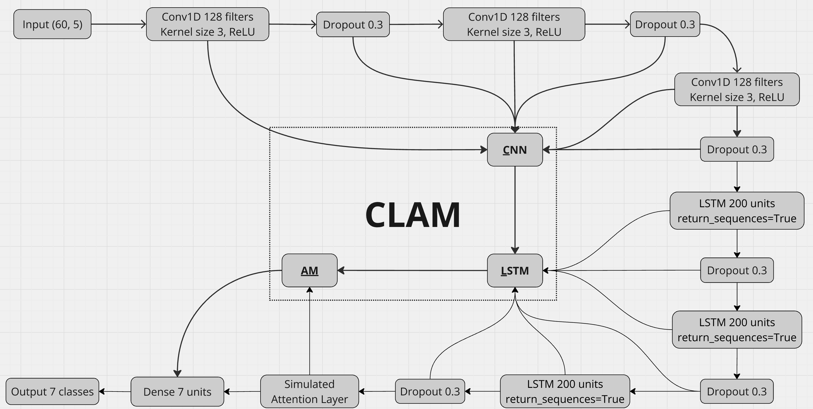

# CLAM: CNN-LSTM-AM Stock Price Prediction Model

## Overview

This project implements **CLAM (CNN-LSTM-AM)**, a hybrid deep learning model combining Convolutional Neural Networks (CNN), Long Short-Term Memory (LSTM) networks, and an Attention Mechanism (AM) for stock price prediction. The model is designed to forecast stock prices and trends over a specified period (e.g., 5 days) using historical stock data. It processes time-series data to predict future prices and visualizes the results by comparing predicted trends against actual trends.

The implementation is written in Python and leverages libraries such as TensorFlow/Keras for model building, Pandas for data manipulation, and Matplotlib for visualization. The project includes a sample application using historical stock data (`ABBV.csv`) for the stock ticker ABBV (AbbVie Inc.), but it can be adapted to other stocks by replacing the input data file.

## Features

- **Model Architecture**: Combines CNN layers for feature extraction, LSTM layers for sequential modeling, and an Attention Mechanism to focus on critical time steps.
- **Prediction**: Outputs predicted stock prices for the next 5 days based on 60 days of historical data.
- **Trend Analysis**: Generates "UP" or "DOWN" trend labels for both predicted and actual prices.
- **Visualization**: Plots predicted vs. actual prices with trend annotations and saves the comparison as a high-resolution image (`ctrend.png`).
- **Evaluation**: Tracks training performance using metrics like Mean Absolute Error (MAE) and Root Mean Squared Error (RMSE).

## Model Architecture

The CLAM model consists of the following layers:

| Layer Type       | Output Shape       | Parameters |
|------------------|--------------------|------------|
| Input Layer      | (None, 60, 5)      | 0          |
| Conv1D           | (None, 60, 128)    | 2,048      |
| Dropout          | (None, 60, 128)    | 0          |
| Conv1D           | (None, 60, 128)    | 49,280     |
| Dropout          | (None, 60, 128)    | 0          |
| Conv1D           | (None, 60, 128)    | 49,280     |
| Dropout          | (None, 60, 128)    | 0          |
| LSTM             | (None, 60, 200)    | 263,200    |
| Dropout          | (None, 60, 200)    | 0          |
| LSTM             | (None, 60, 200)    | 320,800    |
| Dropout          | (None, 60, 200)    | 0          |
| LSTM             | (None, 60, 200)    | 320,800    |
| Dropout          | (None, 60, 200)    | 0          |
| Attention        | (None, 200)        | 260        |
| Dense            | (None, 7)          | 1,407      |

- **Total Parameters**: 1,007,075 (3.84 MB)
- **Input**: 60 timesteps with 5 features (e.g., Open, High, Low, Close, Volume).
- **Output**: Predicted prices for the next 7 days (configurable; sample uses 5 days).

## Prerequisites

- **Python**: Version 3.10 or higher
- **Libraries**:
  - `pandas` (data manipulation)
  - `matplotlib` (plotting)
  - `tensorflow` or `keras` (deep learning framework)
  - `numpy` (numerical operations)

Install the required libraries using pip:
```bash
pip install pandas matplotlib tensorflow numpy
